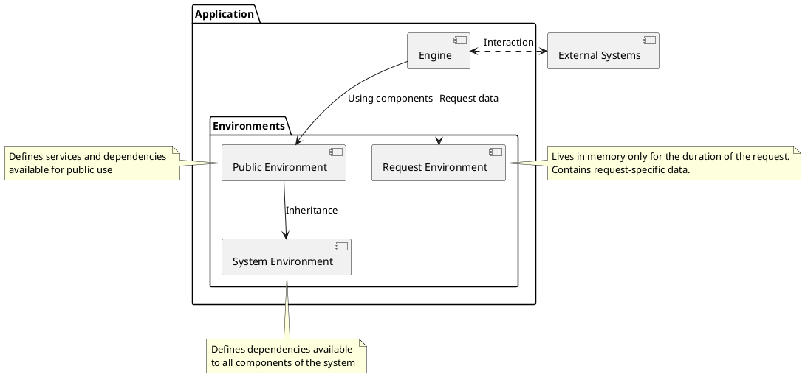

# Architecture

## Overview

This document describes the `Application` pattern of this package.
This pattern is intended for developing a `BackEnd` focused on `API` and remote procedure calls.

The `Application` pattern uses the `Service Manager` pattern, 
forming a unified framework together with it.

## Basic Concepts

