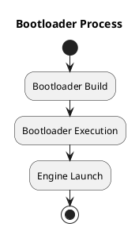
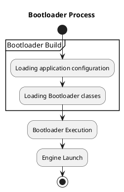
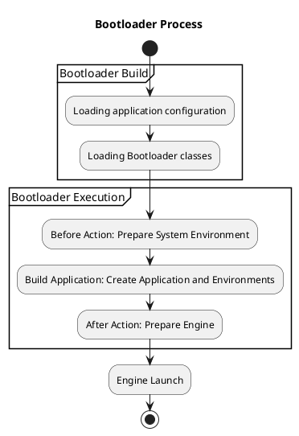

# Bootloader

## Bootloader Process

The `Bootloader` component handles the application's loading 
and initialization process. 

The process is carried out in several stages:

Bootloader construction is performed by the `BootloaderManager`, which executes the following stages:

* Loading the application configuration
* Loading all Bootloader classes that form the `BootloaderExecutor`

The `BootloaderExecutor` executes handlers in a specified sequence of three stages:

* BeforeAction - Initializes the environment. 
Executed before the `Application` and `SystemEnvironment` classes are created.
* BuildApplication - Creates the application and the necessary environments.
* AfterAction - Executed after the application is created, but before the `Engine` is launched.

Once the `Engine` has started, the initialization process is considered complete. The application is loaded into memory and is ready to operate.

## Component Installation

From the application's perspective, a component is considered installed if it has registered itself with the `Bootloader` 
and is therefore available to other components through `Dependency Injection`.

Since components are most often developed as `Composer` packages, 
their installation process is handled by a special installer that extends Composer.

